# *"Reviews en actividades, hobbies, series y películas"*
* [Definición de producto](#Definición-de-producto)
* [Historias de usuario](#Historias-de-usuario)
* [Preguntas y Respuestas (Q & A)](#Preguntas-y-Respuestas)

***
## Definición de producto

El mercado de redes sociales es muy amplio, actualmente todxs lxs usamos para comunicarnos con otras personas, saber de noticias, hechos y como espacios de dispersión. Para ello realizamos encuestas personales y online a diferentes usuarixs. Esto nos dió ideas sobre las necesidades del usuario y qué era lo que más buscaban en una red social.
Llegamos a la conclusión de que lo más buscado son recomendaciones y reviews de actividades, lugares a dónde ir, hobbies, películas, series, etc.. Es por ello que nuestra red social es una plataforma basada en dar y recibir recomendaciones (reviews) de las actividades que los usuarios realizan dentro y/o fuera de casa.

***
## Entrevistas personales 
Con respecto a las entrevistas personales, se formularon preguntas desde qué es lo que buscaban en una red social a nivel de facilidades, lo que les gustaría poder visualizar en sus perfiles, muros, cómo les gustaría interactuar con los reviews de otras personas, hasta colores con los que asocian las actividades para la interfaz de la aplicación.

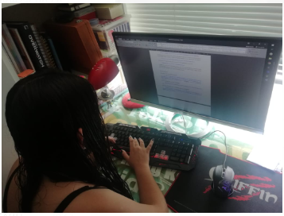
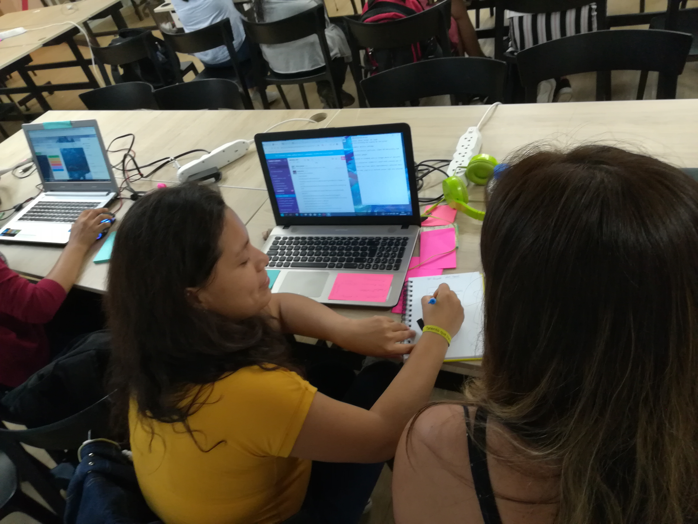

***

## Recopilación de información 
Usamos la plataforma *Trello* para tener una vista clara de los resultados de las entrevistas realizadas y la información que recaudamos.

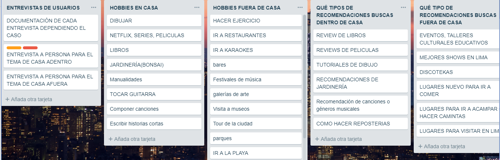
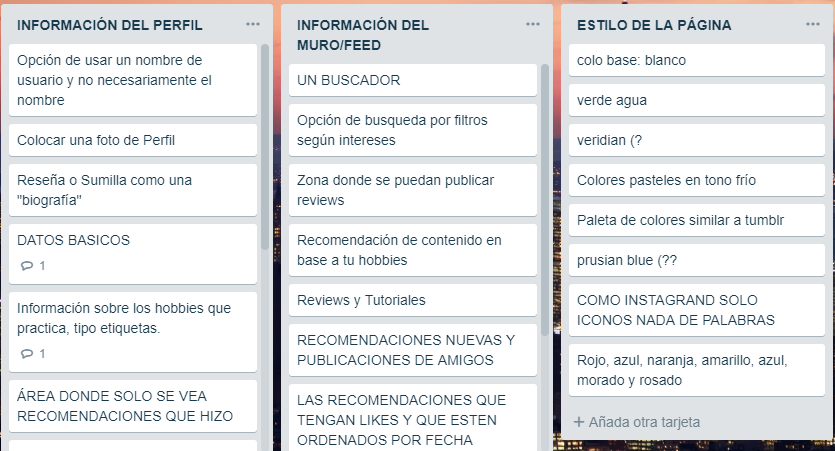

Tras culminar las entrevistas con lxs usuarixs, empezamos a detectar las necesidades principales que tenían. De esta forma podíamos visualizar las ideas que utilizaríamos en nuestra aplicación.
*** 
## Flujo para definir las historias de usuarios
Luego de comparar las entrevistas de nuestros usuarios pasamos a crear un flujo de la aplicación en base a la información recopilada, de esta forma fuimos armando la Red Social y nos llevó a definir nuestras historias de usuario.

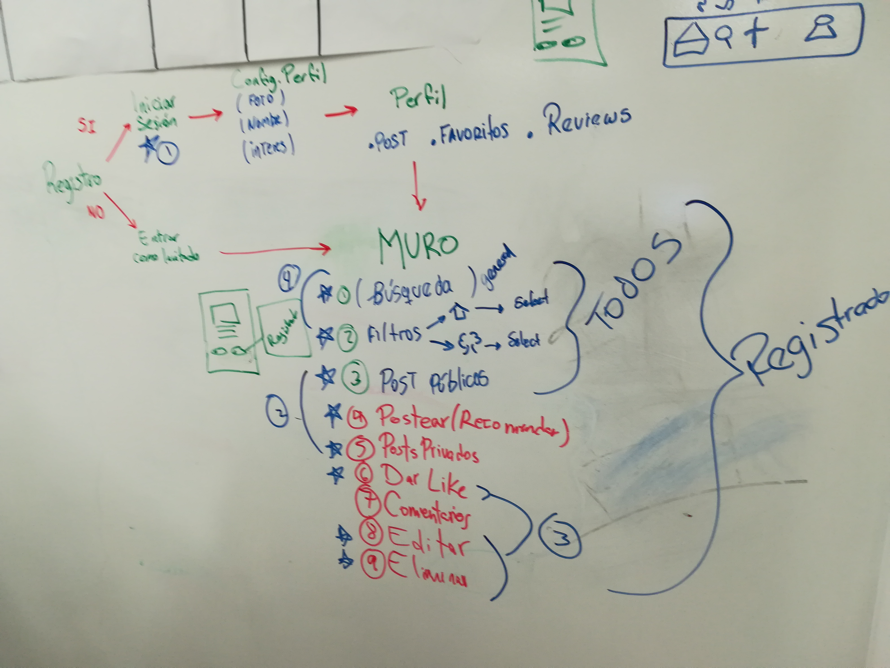

***
## Historias de usuario
Aqui definimos las historias de usuario basado en la recopilación de información de las entrevistas.

* PRIMERA HISTORIA DE USUARIO
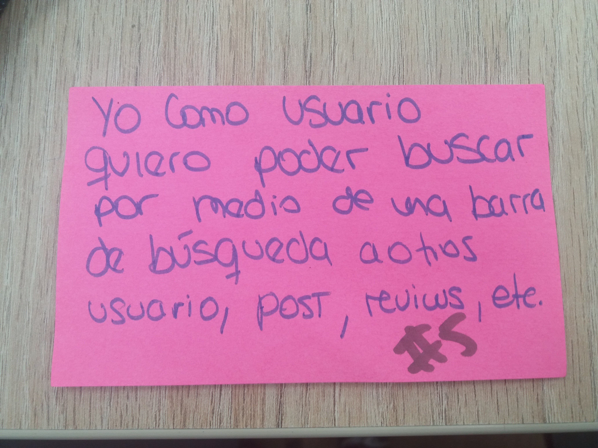

* Definición de terminado de la primera historia de usuario
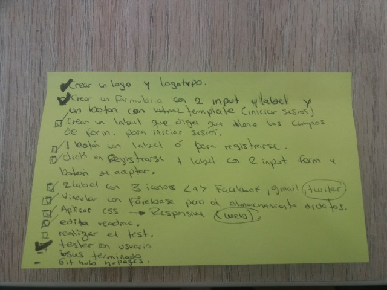

* Prototipo de baja fidelidad de la primer historia de usuario.
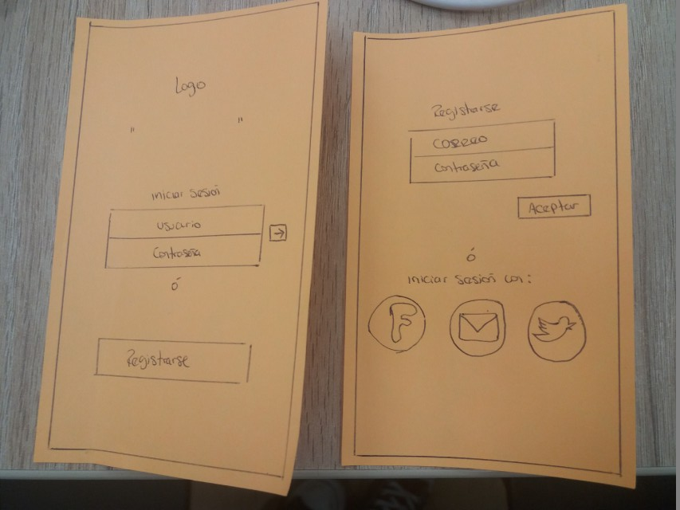

* SEGUNDA HISTORIA DE USUARIO

* Prototipo de baja fidelidad de la segunda historia de usuario.

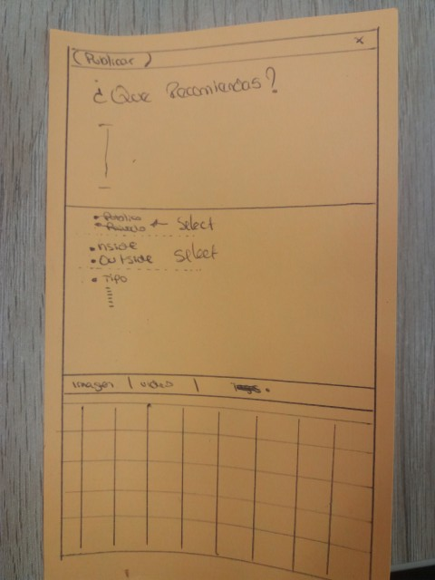

* TERCERA HISTORIA DE USUARIO

* Prototipo de baja fidelidad de la tercera historia de usuario.

* CUARTA HISTORIA DE USUARIO

* Prototipo de baja fidelidad de la cuarta  historia de usuario.

* QUINTA HISTORIA DE USUARIO

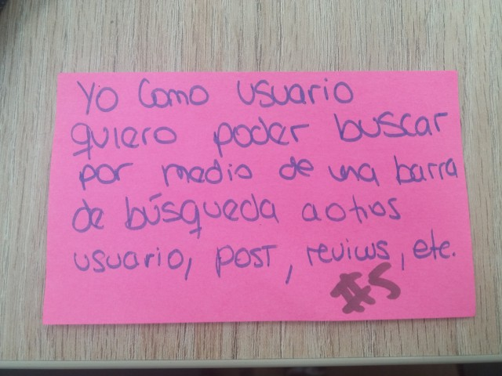

* Prototipo de baja fidelidad de quinta historia de usuario.

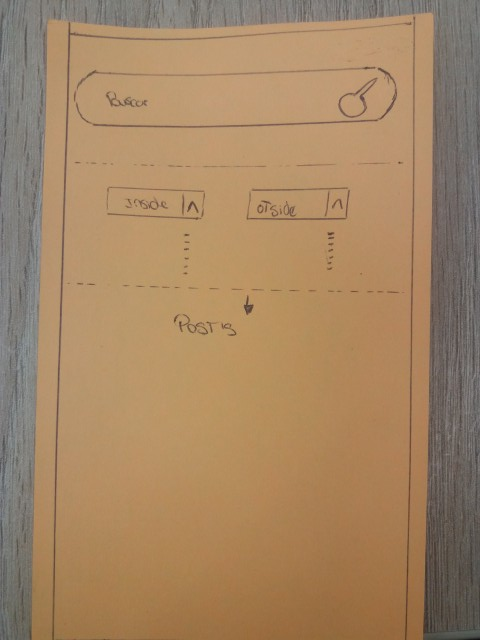

* Definición de terminado de las cuatro historias de usuario (*post*).

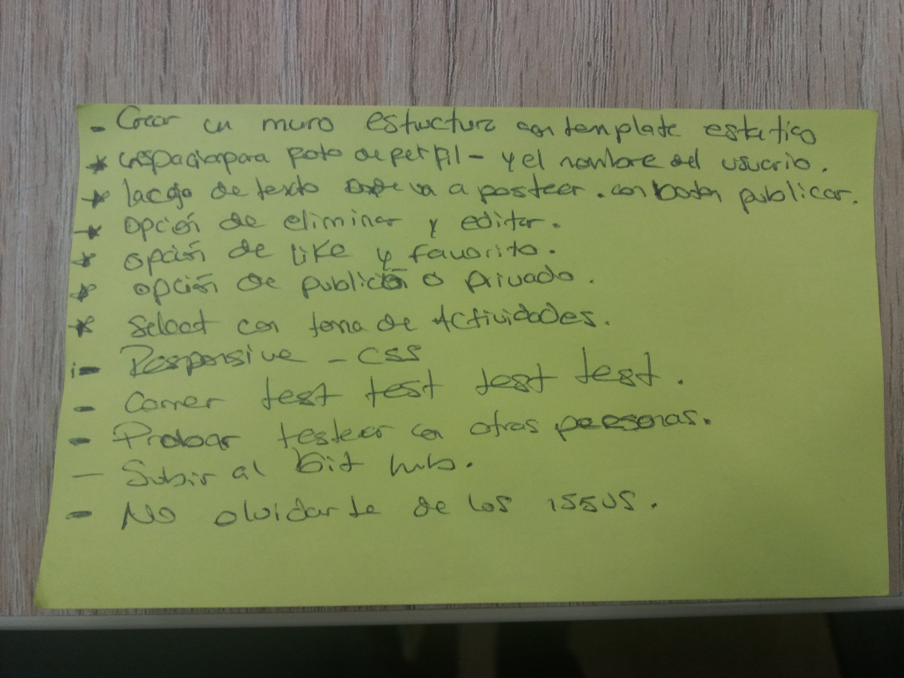

***
## Preguntas y Respuestas 
### ¿Cuáles son los elementos básicos que tiene una red social?
* Esta red social te permite crear una cuenta de usuario registrándote con tu correo, Facebook, Google y Twitter. En tu perfil se podrá visualizar tu nombre, foto y una breve información que proporcionas al momento de registrarte. Luego hay un apartado (*wall*) donde se pueden crear reviews y estos tras ser publicados pueden colocarse de forma pública o privada. Todos los reviews pueden ser 'likeados'❤ y darles 'favorito'⭐. Así mismo, al usuario le es posible poder editar y/o eliminar los posts que ha realizado con anterioridad. 

### ¿Quiénes son lxs principales usuarixs de producto?
* Lxs principales usuarixs de este producto son dos tipos de persona, aquellxs que están buscando empezar un hobbie nuevo y quieren cosejos sobre ello, y el otro tipo de usuario vendrían a ser todas esas personas que quieren brindar información sobre ello. La interacción entre las personas que buscan recomendaciones de actividades y aquellas que se dedican a postear reviews, es lo que mantendría viva la página. 

### ¿Cómo descubriste las necesidades de lxs usuarixs?
* Nos dimos cuenta de que muchxs de nuestrxs usuarixs no saben qué hacer en sus ratos libres y no salen de la rutina, al querer romperla no saben dónde buscar información y pierden tiempo en ello.

### ¿Qué problema resuelve el producto para estxs usuarixs?
* Ayuda a lxs usuarixs a encontrar la información sobre el hobbie que buscan de manera sencilla y eficaz, con el plus de qué conocen personas interesadas en el hobbie.

### ¿Cómo verificaste que el producto les está resolviendo sus problemas?
* La forma más clara de que el producto está resolviendo problemas es mediante la interacción de lxs usuarixs que buscan los reviews con los posts. Los botones de reacción en los post nos permitirá ver si en efecto una publicación sirvió de algo o no. El uso de la aplicacón y las interacciones de las personas es lo que permite ver si ha sido exitoso o no. 