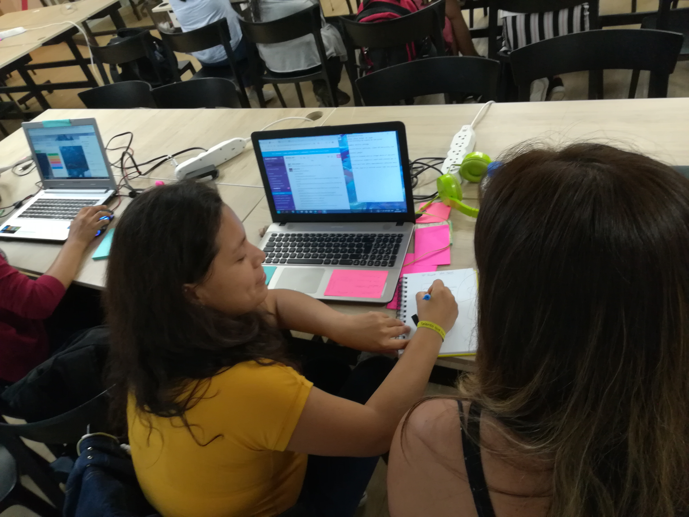

# Red Social
* [Definición de producto](#Definición-de-producto)
* [Historias de usuario](#Historia-de-usuario)

***
# Definición de producto
***
El mercado de redes sociales es muy amplio, actualmente todxs las usamos para comunicarnos con otras personas, saber de noticias, hechos y como espacios de dispersión. Para ello realizamos encuestas a diferentes usuarios y se realizo con una cuestionario de preguntas online y personal.
la cuál nos dieron ideas de que necesitaban la mayoria de usuarios y que era lo que más buscaban en una red social.
Llegando a una conclusión de todas las entrevistas,lo que más buscan son recomendaciones y también las brindan, es por ello que nuestra red social es sobre dar y recibir recomendaciones de las actividades que realizan dentro y/o fuera de casa.

* Entrevistas personales

* Recopilación de información 

* Flujo para definir las historias de usuarios

*** 
creamos un flujo con todo lo requerido para realizar la red social y esto nos va a yudar a definir las historias de usuario.

# Historias de usuario

***
Aqui definimos las historias de usuario basado en la recopilación de información de las entrevistas.

* primera historia de usuario

* definición de terminado de la primera historia de usuario

* prototypo de baja fidelidad de la primer historia de usuario.

* segunda historia de usuario

* definición de terminado de la segunda historia de usuario

* prototypo de baja fidelidad de la segunda historia de usuario.

* tercera historia de usuario

* definición de terminado de la tercera historia de usuario

* prototypo de baja fidelidad de la tercera historia de usuario.

* cuarta historia de usuario

* definición de terminado de la cuarta historia de usuario

* prototypo de baja fidelidad de la cuarta  historia de usuario.

* quinta historia de usuario

* definición de terminado de quinta historia de usuario

* prototypo de baja fidelidad de quinta historia de usuario.

* Cuáles son los elementos básicos que tiene una red social

* Quiénes son los principales usuarios de producto

* Cómo descubriste las necesidades de los usuarios

* Qué problema resuelve el producto para estos usuarios

* Cuáles son los objetivos de estos usuarios en relación con el producto

* Cuáles son las principales funcionalidades del producto y cuál es su prioridad

* Cómo verificaste que el producto les está resolviendo sus problemas

* Cómo te asegurarás que estos usuarios usen este producto

