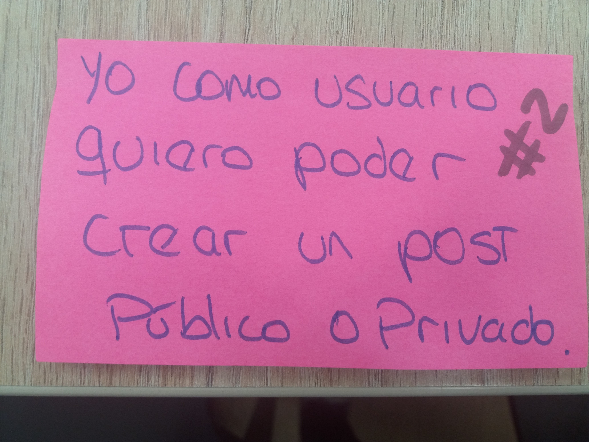
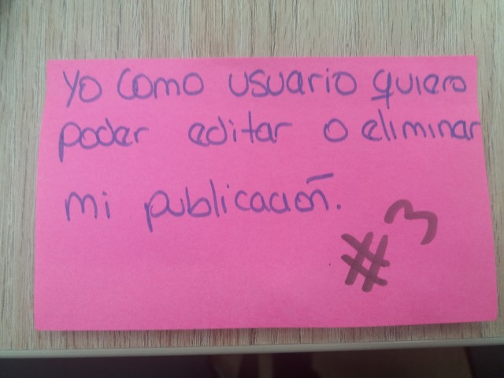
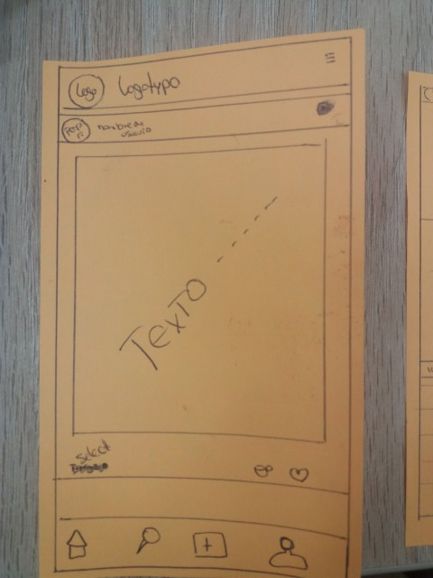

# Red Social
* [Definición de producto](#Definición-de-producto)
* [Historias de usuario](#Historia-de-usuario)

***
# Definición de producto
***
El mercado de redes sociales es muy amplio, actualmente todxs las usamos para comunicarnos con otras personas, saber de noticias, hechos y como espacios de dispersión. Para ello realizamos encuestas personales y online a diferentes usuarios. Esto nos dió ideas de lo que la mayoria de usuarios necesitaba y qué era lo que más buscaban en una red social.
Llegamos a la conclusión que lo que más buscan son recomendaciones y reviews de actividades, lugares a dónde ir, hobbies, películas, series, etc.. Es por ello que nuestra red social es una plataforma para poder dar y recibir recomendaciones de las actividades que realizan dentro y/o fuera de casa.

* Entrevistas personales
Con respecto a las entrevitas personales, se abarcaron preguntas desde qué es lo que buscaban en una red social a nivel de facilidades, lo que les gustaría poder visualizar en sus perfiles, muros, cómo les gustaría interactuar con los reviews que otros les dan, hasta colores con los que asocian las actividades para la interfaz de la aplicación.

***

* Recopilación de información 

***

Tras culminas las entrevistas con los 3 usuarios escogidos, se pasó a recopilar y comparar la información que teníamos. De esta forma podíamos visualizar las respuestas a las mismas preguntas que habíamos hecho y podíamos conocer mejor la opinión de nuestros entrevistados.

* Flujo para definir las historias de usuarios

*** 
Luego de comparar las entrevistas de nuestros usuarios pasamos a crear un flujo para poder identificar las necesidades del usuario, de esta forma fuimos armando la Red Social y nos llevó a definir nuetras historias de usuario.

# Historias de usuario

***
Aqui definimos las historias de usuario basado en la recopilación de información de las entrevistas.

* primera historia de usuario

* definición de terminado de la primera historia de usuario

* prototypo de baja fidelidad de la primer historia de usuario.

* segunda historia de usuario

* prototypo de baja fidelidad de la segunda historia de usuario.

* tercera historia de usuario

* prototypo de baja fidelidad de la tercera historia de usuario.

* cuarta historia de usuario

* prototypo de baja fidelidad de la cuarta  historia de usuario.

* quinta historia de usuario

* prototypo de baja fidelidad de quinta historia de usuario.

* Cuáles son los elementos básicos que tiene una red social
Esta red social te permite crear una cuenta de usuario registrandote con tu correo, así también con tus cuentas de Facebook, Google y Twitter. En tu perfil se podrá visualizar tus nombres, foto y una breve información acerca de tus las actividades que al usuario le gusta realizar. Luego hay un apartado donde se pueden crear reviews y estos tras ser públicados pueden colocarse de forma pública o privada. Todos los reviews pueden ser 'likeados' y darles 'favorito'. Así mismo, al usuario le es posible poder editar y/o eliminar los posts que ha realizado con anterioridad. 

* Quiénes son los principales usuarios de producto
Los principales usuarios de este producto son dos tipos de persona, aquellas que están en la búsqueda de realizar alguna actividad o hobbie nuevo o que no sabe dónde o cómo realizarlos, y el otro tipo de usuario vendrían a ser todas esas personas que buscan dar una opinión al respecto. La interacción entre las personas que buscan recomendaciones de actividades y aquellas que se dedican a postear reviews, es lo que mantedría viva la página. 

* Cómo descubriste las necesidades de los usuarios
Esta necesidad surgió de que muchos de nuestros usuarios no saben qué hacer en sus ratos libres y no salen de la rutina, al querer romperla no saben dónde buscar o pierden mucho tiempo buscando qué hacer.

* Qué problema resuelve el producto para estos usuarios
Es claro que si existiera una herramienta que les permitiera poder encontrar esta información de manera rápida y eficaz, el problema de no saber cómo, cuándo ni dónde estaría resuelto.

* Cómo verificaste que el producto les está resolviendo sus problemas
La forma más clara de que el producto está resolviendo problemas es mediante la interacción de los usuarios que buscan los reviews con los posts. Los botones que se encuentran en la parte inferior permitirá ver si en efecto una publicación sirvió de algo o no. El uso de la aplicacón es lo que permite ver si ha sido exitoso o no. 

